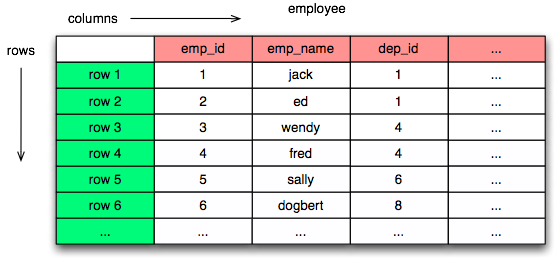
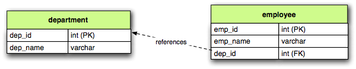
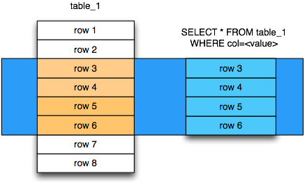
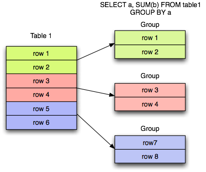

===========================
Relational Database Review
===========================

Introduction
============

This document is a brief overview of key relational database concepts, including SQL basics as well as the basics
of transactions.  SQLAlchemy is somewhat unique in that it doesn't try to hide any of these concepts
within regular use, and the developer of a SQLAlchemy-enabled application will
be dealing with concepts of SQL, transactions, and Python expressions and object
models, all at the same time.   While this may sound daunting, it is in practice actually a better way
to work, instead of relying upon a tool to hide away the existence of the relational database.  Best
of all, once the practice of integrating all three techniques is mastered,
you'll be able to call yourself an Alchemist :).

The *Introduction to SQLAlchemy* tutorial starts off with the assumption that the student is familiar
with the concepts outlined in this document - if they're new to you, spending some time familiarizing
will be time well spent, and if they're old hat, you'll be in good shape to jump right into the
SQLAlchemy tutorial.

Throughout this document, we'll try to refer heavily to the :doc:`Glossary <glossary>`, which
tries to provide an overview and additional links on just about every concept.

Overview
========

* Relational Databases, or RDBMS, are databases that draw upon the
  :term:`Relational Model`, created by :term:`Edgar Codd`.

* RDBMS organizes data into tables, rows, and columns, mimicking
  similar concepts in the relational model.

* The relational model encourages :term:`normalization`, which is a system of
  minimizing repetition and dependency between rows.

* RDBMSs use :term:`Structured Query Language` to access and manipulate rows.

* RDBMSs provide guarantees for data using the :term:`ACID` model.

.. _ddl:

Relational Schemas
==================

The :term:`schema` refers to a fixed structure configured within a database
that defines how data will be represented.   The most fundamental unit
of data within a schema is known as the :term:`table`.

Table
-----

The Table is the basic unit of storage in a relational database, representing a set of rows.

The table encompasses a series of :term:`columns`, each of which describes a particular type
of data unit within the table.  The data within the table is then organized into
:term:`rows`, each row containing a single value for each column represented in the table.

DDL
---

At the SQL console, we create a new table as a permanent fixture within a
database schema using the ``CREATE TABLE``
statement.  The ``CREATE TABLE`` statement is an example of Data Definition Language, or
:term:`DDL`, which is a subset of SQL:

.. sourcecode:: sql

    CREATE TABLE employee (
         emp_name VARCHAR(30),
         dep_id INTEGER
    )

.. _primary_key:

Primary Keys
------------

A table can be created with :term:`constraints`, which place rules on
what specific data values can be present in the table.   One of the
most common constraints is the :term:`primary key constraint`, which enforces that every
row of the table must have a uniquely identifying value, consisting of one
or more columns, where the values can additionally not be NULL.
A primary key that uses more than one column to produce
a value is known as a :term:`composite` primary key.

It is a best practice that all tables in a relational database
contain a primary key.  Two varieties of primary key are :term:`surrogate primary key`
and :term:`natural primary key`, where the former is specifically a "meaningless"
value, and the latter is "meaningful".   Which style to use is a hotly debated
topic; the surrogate key is generally chosen for pragmatic reasons, including
memory and index performance as well as simplicity when dealing with updates,
whereas the natural primary key
is often chosen for being more "correct" and closer to the relational ideal.
We restate our ``employee`` table below adding a surrogate integer primary key
on a new column ``emp_id``:

.. sourcecode:: sql

    CREATE TABLE employee (
         emp_id INTEGER,
         emp_name VARCHAR(30),
         dep_id INTEGER,
         PRIMARY KEY (emp_id)
    )

.. _foreign_key:

Foreign Keys
------------

Once a table is defined as having a primary key constraint,
another table can be constrained such that its rows may refer
to a row that is guaranteed to be present in this table.
This is implemented by establishing a column or columns in the
"remote", or child, table whose values must match a value of the primary
key of the "local", or parent, table.  Both sets of columns are then named as
members of a :term:`foreign key constraint`, which instructs
the database to enforce that values in these "remote" columns are guaranteed
to be present in the "local" table's set of primary key columns.
This constraint takes effect at every turn; when rows are inserted
into the remote table, when rows are modified in the remote table,
as well as when an attempt is made to delete or update rows in the
parent table, the database ensures that any value subject to the
foreign key constraint be present in the set of referenced columns,
or the statement is rejected.

A foreign key constraint that refers fully to a
composite primary key is predictably known as a *composite foreign key*.
It is also possible, in a composite scenario, for a foreign key constraint
to only refer to a subset of the primary key columns in the
referenced table, but this is a highly unusual case.

Below,
the figure illustrates a
``department`` table which is referred to by the ``employee`` table by
relating the ``employee.dep_id`` column to the ``department.dep_id``
column:

The above schema can be created using DDL as follows:

.. sourcecode:: sql

    CREATE TABLE department (
         dep_id INTEGER,
         dep_name VARCHAR(30),
         PRIMARY KEY (dep_id)
    )

    CREATE TABLE employee (
         emp_id INTEGER,
         emp_name VARCHAR(30),
         dep_id INTEGER,
         PRIMARY KEY (emp_id),
         FOREIGN KEY (dep_id)
           REFERENCES department(dep_id)
    )

.. _normalization:

Normalization
-------------

The structure of a relational schema is based on a system known as :term:`relational
algebra`.  The central philosophy that drives the design of a relational schema
is a process known as :term:`normalization`, which like most fundamental computer
science concepts is an entire field of study onto itself.   In practice however,
normalization usually boils down to a few simple practices that become second
nature in not too much time.

The general idea of normalization is to eliminate the repetition of data, so that
any one particular piece of information is represented in exactly one place.
By doing so, that piece of information becomes one of many atomic units by which
data can be searched and operated upon.  For example, if hundreds of records
all refer to a particular date record, we can correlate all those records on this
single date record strictly based on the association of those identities.

A typical example of denormalized data looks like::

  Employee Language
  ------------------
  name        language   department
  -------     --------   -------------
  Dilbert     C++        Systems
  Dilbert     Java       Systems
  Wally       Python     Engineering
  Wendy       Scala      Engineering
  Wendy       Java       Engineering

The table's rows can be uniquely identified by the composite of the "name" and
"language" columns, which therefore make up the table's :term:`candidate key`.
Normalization theory would claim the above table violates "second normal form"
because the "non prime" attribute "department" is logically dependent
only on the "name" column, which is a subset of the candidate key.
(Note that the author is carefully parsing the Wikipedia page for normalization
here in order to state this correctly).   A proper normalization would use two
tables along the lines of the following::

  Employee Department
  -------------------
  name        department
  --------    -----------
  Dilbert     Systems
  Wally       Engineering
  Wendy       Engineering

  Employee Language
  ------------------
  name        language
  --------    --------
  Dilbert     C++
  Dilbert     Java
  Wally       Python
  Wendy       Scala
  Wendy       Java

While the formal reasoning behind the above change may be difficult to
parse, a visual inspection of the data reveals more obviously
how the second form is an improvement; the original version repeats
duplicate associations between "name" and "department" many times
according to how many distinct "language" values correspond to a name;
whereas the second version uses separate tables so that each "name/department"
and "name/language" association can be expressed independently.

The concept of data constraints, particularly the primary key constraint
and the foreign key constraint, are designed to work naturally with
the concept of normalization.   Constraints would be applied to the above
schema by establishing "Employee Department->name" as a primary key,
establishing "Employee Language->name, language" as a composite primary key,
and then creating a foreign key such that "Employee Language->name" must
refer to "Employee Department->name".  When a schema resists being
organized into simple primary and foreign key relationships, that's often
a sign that it isn't strongly normalized.

The Wikipedia page on normalization (http://en.wikipedia.org/wiki/Database_normalization)
is a great place to learn more.

.. _dml:

Data Manipulation Language (DML)
================================

Once we have a schema defined, data can be placed into the tables
and also modified using another subset of SQL called :term:`data manipulation language`,
or DML.

Inserts
-------

New rows are added to a table using the ``INSERT`` statement.  The ``INSERT`` statement
contains a ``VALUES`` clause which refers to the actual values to be inserted
into each row.

.. sourcecode:: sql

    INSERT INTO employee (emp_id, emp_name, dep_id)
                VALUES (1, 'dilbert', 1);

    INSERT INTO employee (emp_id, emp_name, dep_id)
                VALUES (2, 'wally', 1);

.. topic:: Auto Incrementing Integer Keys

  Most modern databases feature a built-in system of generating incrementing integer
  values, which are in particular usually used for tables that have surrogate integer
  primary keys, such as our ``employee`` and ``department`` tables.   For example, when using
  SQLite, the above ``emp_id`` column will generate an integer value automatically; when
  using MySQL, an integer primary key declared with ``AUTO INCREMENT`` will do so as well;
  and on Postgresql, declaring a primary key with the datatype ``SERIAL`` will have
  the same end effect.  When using these so-called "auto incrementing" primary key
  generators, we *omit* the column from the INSERT statement:

  .. sourcecode:: sql

      INSERT INTO employee (emp_name, dep_id)
                  VALUES ('dilbert', 1);

      INSERT INTO employee (emp_name, dep_id)
                  VALUES ('wally', 1);

  Databases that feature primary key generation systems will also
  feature some means of acquiring the "generated" integer identifier
  after the fact, using non-standard SQL extensions and/or functions.
  When using Postgresql, one such way of reading these generated identifiers
  is to use ``RETURNING``:

  .. sourcecode:: sql

      INSERT INTO employee (emp_name, dep_id)
                  VALUES ('dilbert', 1) RETURNING emp_id;

      emp_id
      ------
        1

  While every database features a different system of generating and retrieving
  these keys, we'll generally refer to the style above where the integer primary key
  can be omitted from an INSERT.   When using SQLAlchemy, one of the most fundamental
  features it provides is a consistent and transparent system
  of utilizing the wide variety of key generation and retrieval schemes.

Updates
--------

The ``UPDATE`` statement changes the contents of an existing row, using a ``WHERE`` clause
to identify those rows which are the target of the update, and a ``SET`` clause which
identifies those columns which should be modified and to what values:

.. sourcecode:: sql

    UPDATE employee SET dep_id=7 WHERE emp_name='dilbert'

When an UPDATE statement like the above one executes, it may match any number of
rows, including none at all.  An UPDATE statement typically has a "row count"
value associated with a particular execution, which indicates the number of
rows that matched the WHERE criteria, and therefore represents the number
of rows that were subject to the SET clause.

Deletes
-------

The ``DELETE`` statement removes rows.  Like the ``UPDATE`` statement, it also uses
a ``WHERE`` clause to identify those rows which should be deleted:

.. sourcecode:: sql

    DELETE FROM employee WHERE dep_id=1

Above, all employee records within department id 1 will be deleted.

.. _queries:

Queries
=======

The key feature of SQL is its ability to issue queries.   The ``SELECT``
statement is the primary language construct providing this feature,
and is where we spend most of our time when
using relational databases, allowing us to query for rows in tables.

An illustration of a ``SELECT`` statement is in the figure below.  Like
the ``UPDATE`` and ``DELETE`` statements, it also features a ``WHERE`` clause which is the
primary means of specifying which rows should be selected.

An example of a ``SELECT`` that chooses the rows where ``dep_id`` is equal
to the value ``12``:

.. sourcecode:: sql

    SELECT emp_id, emp_name FROM employee WHERE dep_id=12

The key elements of the above ``SELECT`` statement are:

1. The :term:`FROM clause` determines the table or tables from which we are
   to select rows.

2. The :term:`WHERE clause` illustrates a criterion which we use to filter
   those rows retrieved from the tables in the ``FROM`` clause

3. The :term:`columns clause` is the list of expressions following the ``SELECT``
   keyword and preceding the ``FROM`` keyword, and indicates
   those values which we'd like to display given each row that we've
   selected.

With the above rules, our statement might return to us a series of rows
that look like this, if the ``emp_name`` column values ``wally``, ``dilbert``,
and ``wendy`` were all those linked to ``dep_id=12``::

        emp_id    emp_name
        -------+------------
          1    |   wally
          2    |   dilbert
          5    |   wendy

Ordering
--------

The ``ORDER BY`` clause may be applied to a ``SELECT`` statement to determine the
order in which rows are returned.   Ordering is applied to the ``SELECT`` after
the ``WHERE`` clause.   Below, we illustrate our statement loading employee
records ordered by name:

.. sourcecode:: sql

    SELECT emp_id, emp_name FROM employee WHERE dep_id=12 ORDER BY emp_name

Our result set then comes back like this::

        emp_id    emp_name
        -------+------------
          2    |   dilbert
          1    |   wally
          5    |   wendy

Joins
-----

A ``SELECT`` statement can use a :term:`join` to produce rows from two tables at
once, usually joining along foreign key references.    The ``JOIN`` keyword
is used in between two table names inside the ``FROM`` clause of a ``SELECT``
statement.   The ``JOIN`` also usually includes an ``ON`` clause, which
specifies criteria by which the rows from both tables are correlated
to each other.

The figure below illustrates the behavior of a join, by indicating in the
central blue box those rows which are *composites* of rows from both "table_1" and "table_2"
and which satisfy the ``ON`` clause:

.. image:: review_join.png

It's no accident that the blue box looks a lot like a table.  Even though above,
only "table_1" and "table_2" represent fixed tables, the ``JOIN`` creates
for us what is essentially a *derived table*, a list of rows that we could
use in subsequent expressions.

Using our department / employee example, to select employees along with their
department name looks like:

.. sourcecode:: sql

    SELECT e.emp_id, e.emp_name, d.dep_name
        FROM employee AS e
        JOIN department AS d
          ON e.dep_id=d.dep_id
       WHERE d.dep_name = 'Software Artistry'

The result set from the above might look like::

        emp_id    emp_name         dep_name
        -------+------------+--------------------
          2    |   dilbert  |  Software Artistry
          1    |   wally    |  Software Artistry
          5    |   wendy    |  Software Artistry

Left Outer Join
---------------

A variant of the join is the :term:`left outer join`.  This structure allows
rows to be returned from the table on the "left" side which don't have any
corresponding rows on the "right" side.   For instance, if we wanted to select
departments and their employees, but we also wanted to see the names of departments
that had no employees, we might use a ``LEFT OUTER JOIN``:

.. sourcecode:: sql

    SELECT d.dep_name, e.emp_name
        FROM department AS d
        LEFT OUTER JOIN employee AS e
        ON d.dep_id=e.dep_id

Supposing our company had three departments, where the "Sales" department
was currently without any employees, we might see a result like this::

           dep_name          emp_name
      --------------------+------------
       Management         |   dogbert
       Management         |   boss
       Software Artistry  |   dilbert
       Software Artistry  |   wally
       Software Artistry  |   wendy
       Sales              |   <NULL>

There is also a "right outer join", which is the same as left outer join except
you get all rows on the right side.   However, the "right outer join" is not
commonly used, as the "left outer join" is widely accepted as proper convention,
and is arguably less confusing than a right outer join (in any case, right outer joins
confuse the author!).

Aggregates
----------

An :term:`aggregate` is a function that produces a single value, given
many values as input.   A commonly used aggregate function is the ``count()``
function which, given a series of rows as input, returns the count of those
rows as an integral value.  The ``count()`` function accepts as an argument any
SQL expression, which we often pass as the wildcard string ``*`` that essentially
means "all columns" - unlike most aggregate functions, ``count()`` doesn't
evaluate the meaning its argument, it only counts how many times it is called:

.. sourcecode:: sql

    SELECT count(*) FROM employee

    ?count?
    -------

       18

Another aggregate expression might return to us the average number
of employees within departments.   To accomplish this, we also make use of
the ``GROUP BY`` clause, described below, as well as a :term:`subquery`:

.. sourcecode:: sql

    SELECT avg(emp_count) FROM
      (SELECT count(*) AS emp_count
        FROM employee GROUP BY dep_id) AS emp_counts

    ?avg?
    -----
      2

Note the above query only takes into account non-empty departments.  To
include empty departments would require a more complex sub-query that
takes into account rows from ``department`` as well.

Grouping
--------

The ``GROUP BY`` keyword is applied to a ``SELECT`` statement, breaking
up the rows it selects into smaller sets based on some criteria.   ``GROUP BY``
is commonly used in conjunction with aggregates, as it can apply individual
subsets of rows to the aggregate function, yielding an aggregated return value
for each group.  The figure below illustrates the rows from a table being broken
into three sub-groups, based on the expression "a", and then the ``SUM()``
aggregate function applied to the value of "b" for each group:

An example of an aggregation / ``GROUP BY`` combination that gives us the count of employees
per department id:

.. sourcecode:: sql

    SELECT count(*) FROM employee GROUP BY dep_id

The above statement might give us output such as::

    ?count?  |   dep_id
    ---------+----------
        2    |     1
        10   |     2
        6    |     3
        9    |     4

Having
------
After we've grouped things with ``GROUP BY`` and gotten aggregated values
by applying aggregate functions, we can be filter those results using the ``HAVING`` keyword.
We can take the above result set and return only those
rows where more than seven employees are present:

.. sourcecode:: sql

    SELECT count(*) as emp_count FROM employee GROUP BY dep_id HAVING emp_count > 7

The result would be::

    emp_count  |   dep_id
    -----------+----------
        10     |     2
         9     |     4

SELECT Process Summary
----------------------

It's very helpful (at least the author thinks so) to keep straight exactly
how ``SELECT`` goes about its work when given a combination of aggregation and
clauses (such as ``WHERE``, ``ORDER BY``, ``GROUP BY``, ``HAVING``).

Given a series of rows::

    emp_id    emp_name     dep_id
    -------+------------+----------
      1    |   wally    |     1
      2    |   dilbert  |     1
      3    |   jack     |     2
      4    |   ed       |     3
      5    |   wendy    |     1
      6    |   dogbert  |     4
      7    |   boss     |     3

We'll analyze what a ``SELECT`` statement like the following does in a logical sense:

.. sourcecode:: sql

    SELECT count(emp_id) as emp_count, dep_id
        FROM employee
        WHERE dep_id=1 OR dep_id=3 OR dep_id=4
        GROUP BY dep_id
        HAVING emp_count > 1
        ORDER BY emp_count, dep_id

1. the ``FROM`` clause is operated upon first.  The table or tables which the statement is to
   retrieve rows from are resolved; in this case, we start with the set of all rows
   contained in the ``employee`` table:

    .. sourcecode:: sql

            ... FROM employee ...

            emp_id    emp_name     dep_id
            -------+------------+----------
              1    |   wally    |     1
              2    |   dilbert  |     1
              3    |   jack     |     2
              4    |   ed       |     3
              5    |   wendy    |     1
              6    |   dogbert  |     4
              7    |   boss     |     3

2. For the set of all rows in the ``employee`` table, each row is tested against the
   criteria specified in the ``WHERE`` clause.  Only those rows which evaluate to "true"
   based on this expression are returned.  We now have a subset of rows retrieved
   from the ``employee`` table:

    .. sourcecode:: sql

            ... WHERE dep_id=1 OR dep_id=3 OR dep_id=4 ...

            emp_id    emp_name     dep_id
            -------+------------+----------
              1    |   wally    |     1
              2    |   dilbert  |     1
              4    |   ed       |     3
              5    |   wendy    |     1
              6    |   dogbert  |     4
              7    |   boss     |     3

3. With the target set of rows assembled, ``GROUP BY`` then organizes the rows into groups
   based on the criterion given.  The "intermediary" results of this grouping will be passed
   on to the next step behind the scenes.  Were we able to look into the pipeline, we'd see
   something like this:

    .. sourcecode:: sql

            ... GROUP BY dep_id ...

             "group"    emp_id    emp_name     dep_id
            ----------+---------+------------+---------
            dep_id=1  |    1    |   wally    |     1
                      |    2    |   dilbert  |     1
                      |    5    |   wendy    |     1
            ----------+---------+------------+---------
            dep_id=3  |    4    |   ed       |     3
                      |    7    |   boss     |     3
            ----------+---------+------------+---------
            dep_id=4  |    6    |   dogbert  |     4

4. Aggregate functions are now applied to each group.   We've passed
   emp_id to the ``count()`` function, which means for group "1" it will
   receive the values "1", "2", and "5", for group "3" it will
   receive the values "4" and "7", for group "4" it receives the value
   "6".  ``count()`` doesn't actually care
   what the values are, and we could as easily have passed in ``*``, which
   means "all columns".  However, most aggregate functions do care
   what the values are, including functions like ``max()``, ``avg()``
   ``min()`` etc., so it's usually a good habit to be aware of the
   column expression here.  Below, we observe that the "emp_id" and
   "emp_name" columns go away, as we've aggregated on the count:

    .. sourcecode:: sql

            ... count(emp_id) AS emp_count ...

              emp_count     dep_id
            ------------+-----------
                 3      |    1
            ------------+-----------
                 2      |    3
            ------------+-----------
                 1      |    4

5. Almost through all of our keywords, ``HAVING`` takes effect once we have the aggregations,
   and acts like a ``WHERE`` clause for aggregate values.   In our statement, it filters
   out groups that have one or fewer members:

    .. sourcecode:: sql

            ... HAVING emp_count > 1 ...

              emp_count     dep_id
            ------------+-----------
                 3      |    1
            ------------+-----------
                 2      |    3

6. Finally, ``ORDER BY`` is applied.   It's important to remember in SQL that
   relational algebra is a language of *sets*, which are inherently un-ordered.
   In the typical case, all of the work of selecting, aggregating, and filtering
   our data are done before any ordering is applied, and only right before
   the final results are returned to us are they ordered:

    .. sourcecode:: sql

            ... ORDER BY emp_count, dep_id

              emp_count     dep_id
            ------------+-----------
                 2      |    3
            ------------+-----------
                 3      |    1

.. _acid_model:

ACID Model
==========

The flip side to the relational model employed by relational databases is the
so called :term:`transactional` model most of them provide.   The acronym :term:`ACID`
refers to the principal properties of relational database transactions
(as well as transactions for any kind of hypothetical database).

.. _atomicity:

Atomicity
---------

:term:`Atomicity` allows multiple statements to proceed within a particular demarcation known
as a :term:`transaction`, which has a single point of completion known as a :term:`commit`.
A transaction is committed once all the operations within it have completed successfully.
If any of the operations fail, the transaction can instead be reverted using a :term:`rollback`,
which reverses all the steps that have proceeded within the transaction, leaving the state
of the database unchanged relative to before the transaction began.  Atomicity refers
to the fact that all of these steps proceed or fail as a single unit; it's not possible for
some of the steps to succeed without all of them succeeding.

.. _consistency:

Consistency
-----------

:term:`Consistency` encompasses the ability of the database to ensure that it
always remains in a valid state after a transaction completes successfully.
Key elements used to provide consistency are :term:`constraints`, :term:`cascades`,
and :term:`triggers`.

Data constraints, the most common system used to define consistency,
establish rules that are checked against changes in data as those changes
are invoked against the database. Typical constraints include:

    * NOT NULL constraint - value in a column may never be NULL or non-present.

    * :term:`primary key constraint` - each row must contain a single- or multi-column value
      that is unique across all other rows in the table, and is the single value
      that logically identifies the information stored in that row.

    * :term:`foreign key constraint` - a particular column or columns must contain
      a value that exists elsewhere in a different row, usually of a different table.
      The foreign key constraint is the building block by which the rows of many
      flat tables can be composed together to form more intricate geometries.

    * :term:`unique constraint` - similar to the primary key constraint, the unique
      constraint identifies any arbitrary column or set of columns that also
      must be unique throughout the whole table, without themselves comprising
      the primary key.

    * :term:`check constraint` - any arbitrary expression can be applied to a row,
      which will result in that row being rejected if the expression does not
      evaluate to "true".

Constraints are a sometimes misunderstood concept that when properly used can give
a developer a strong "peace of mind", knowing that even in the face of errors,
mistakes, or omissions within applications that communicate with the database,
the database itself will remain in a *consistent* state, rather than running the
risk of accumulating ongoing data errors that are only detected much later when
it's too late.   This "peace of mind" allows us to write and test our applications
more quickly and boldly than we would be able to otherwise; more quickly because
the relational database already does lots of the integrity checking we'd otherwise
have to write by hand, and more boldly because there is much less chance
that code errors can result in corruption of data as if we hadn't used constraints.

.. _isolation:

Isolation
----------

:term:`Isolation` is a complex subject which in a general sense refers to the interactivity
between *concurrent* transactions, that is, more than one transaction occuring at the
same time.  It is focused on the degree to which the work being performed by a particular
transaction may be viewed by other transactions going on at the same time.
The isolation of concurrent transactions is an important area of consideration when
constructing an application, as in many cases the decisions that are made within
the scope of a transaction may be affected by this cross-transaction visibility;
the isolation behavior can also have a significant impact on database performance.
While there are techniques by which one doesn't have to worry too often about isolation,
in many cases dealing with the specifics of isolation is unavoidable, and no one
isolation behavior is appropriate in all cases.

In practice, the level of isolation between transactions is usually placed into
four general categories (there are actually a lot more categories for people who
are really into this stuff):

* Read uncommitted - This is the lowest level of isolation.   In this mode,
  transactions are subject to so-called *dirty reads*, whereby
  the work that proceeds within a transaction is plainly visible to other transactions
  as it proceeds.   With dirty reads, a transaction might UPDATE a row with updated
  data, and this updated row is now globally visible by other transactions.   If the
  transaction is rolled back, all the other transactions will be exposed to this
  rollback as well.

* Read committed - In read committed, we're no longer subject to dirty reads, and
  any data that we read from concurrent transactions is guaranteed to have been
  committed.  However, as we proceed within our own transaction, we can still see
  the values of rows and SELECT statements change, as concurrent transactions
  continue to commit modifications to rows that we're also looking at.

* Repeatable Read - The next level operates at the row level, and adds the behavior
  such that any individual row that we read using a SELECT statement will remain
  consistent from that point on, relative to our transaction.  That is, if we read
  the row with primary key "5" from the ``employee`` table, and in the course of
  our work a concurrent transaction updates the ``emp_name`` column from "Ed" to
  "Edward", when we re-SELECT this row, we will still see the value "Ed" - that is,
  the value of this row remains consistent from the first time we read it forward.
  If we ourselves attempt to update the row again, we may be subject to a conflict when
  we attempt to commit the transaction.

  Within repeatable read, we are still subject to the concept of a so-called
  *phantom read* - this refers to a row that we see in one SELECT statement that
  we later (or previously) do not see in a different SELECT statement, because
  a concurrent transaction has deleted or inserted that row since we last selected
  with a given set of criteria.

* Serializable - Generally considered to be the highest level of isolation, the rough
  idea of serializable isolation is that we no longer have phantom reads -
  if we select a series of N rows using a SELECT statement, we can be guaranteed that
  we will always get those same N rows when emitting a subsequent SELECT of the
  same criteria, even if concurrent transactions have INSERTed or DELETed rows
  from that table.

The impact of using a higher level of isolation depends much on the specifics of
the database in use.   Generally, lower levels of isolation are
associated with higher performance and a reduced chance of :term:`deadlocks`.
Historically, this is due to the fact that
a lower level of isolation has less of a need to synchronize concurrent operations
using locks.   However, most modern relational databases employ a
concept known as :term:`multi version concurrency control` in order to
reduce or eliminate the need for locking, by assigning
to each transaction a unique identifier that is then applied to *copies* of rows
created locally to each transaction.  As a transaction commits its data, its private copies
of rows become the official "rows of record" for the database as a whole.
An MVCC scheme may still introduce performance overhead with higher isolation
levels, as such systems must monitor and report so-called
*serialization failures*, which are the rejection of transactions that
conflict with another one executing concurrently.

.. _durability:

Durability
----------

:term:`Durability` basically means that relational databases provide a guarantee that once a
transaction COMMIT has succeeded, the data is safely written to disk, and the chance of
that data being lost due to a system failure is low to nil.   Durability tends to be something
most developers take for granted when working with relational databases; however, in recent
years it's been discussed a lot more with the rise of so-called NoSQL databases, which in some
cases attempt to scale back the promise of durability in exchange for faster transaction
throughput.

