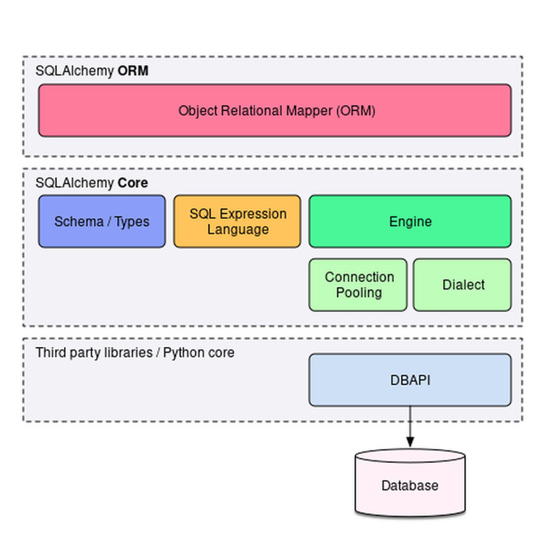
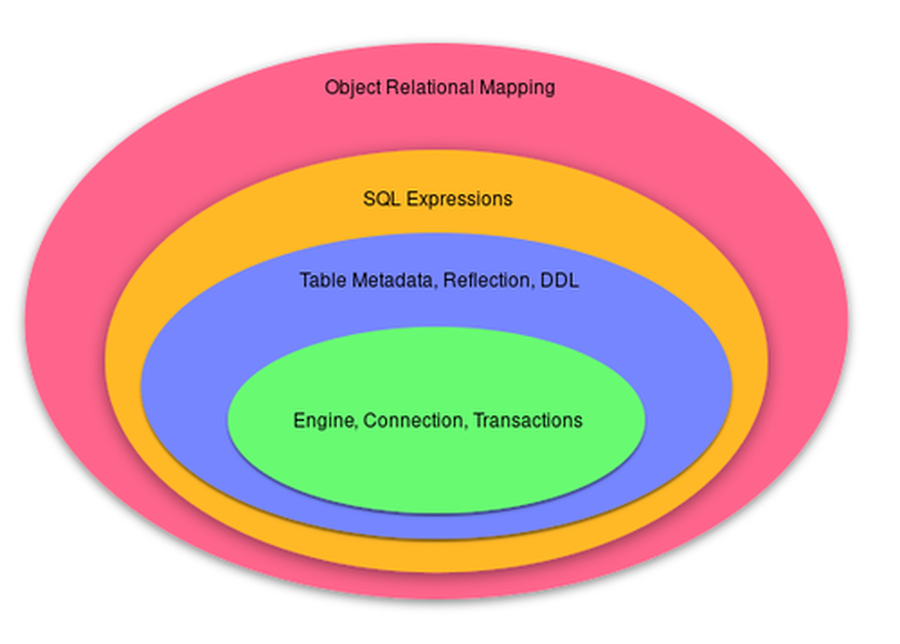
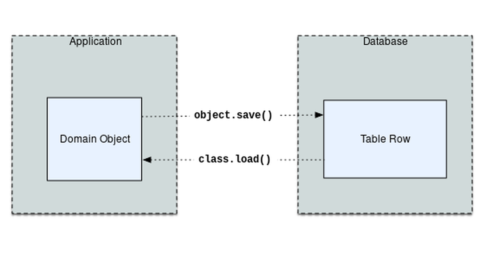
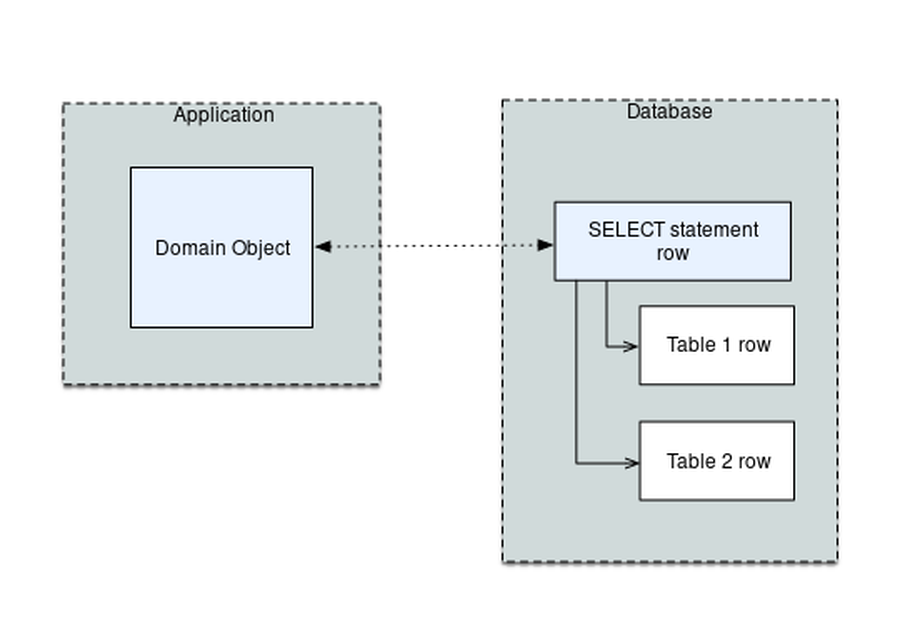
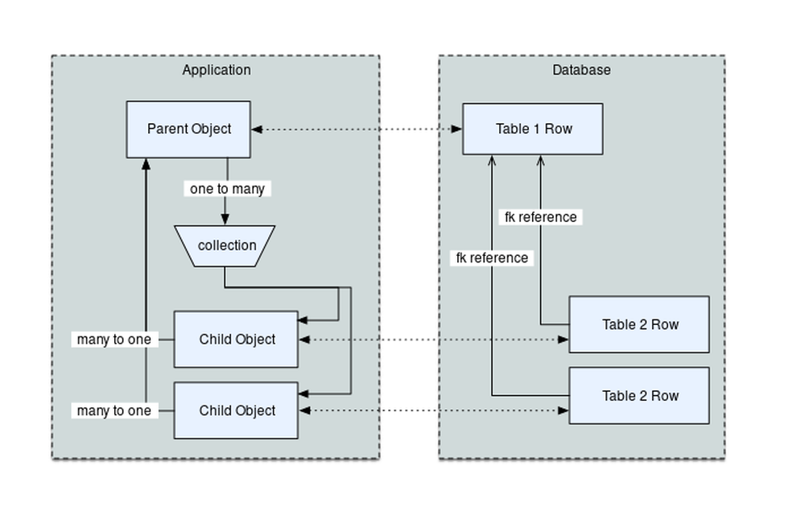

.. rst-class:: titleslide

================================================
 2.0 - The One-Point-Four-Ening 2021
================================================

.. rst-class:: bottom
..

  Mike Bayer

  Companion package::

      git clone http://github.com/zzzeek/sqla_tutorial

Starting Out
=================================

* SQLAlchemy is all about building Python structures that represent SQL database
  concepts in a very direct way.
* It's essential to know at least a little bit of SQL when starting (or you
  will write angry tweets at me!)
* This tutorial will assume basic knowledge of (in order of
  importance):

    * structure: tables, columns, CREATE TABLE, etc.
    * querying: selecting rows with SELECT
    * modifying data with INSERT, UPDATE, DELETE
    * general idea of database transactions (e.g. BEGIN/COMMIT/ROLLBACK)
    * joins, grouping

Presenting SQLAlchemy
=================================

* the Database Toolkit for Python &trade;
* Introduced 2005
* A single system for all things relational database
* Current release **1.4.1**
* The 1.4 series is considered to be transitional for **SQLAlchemy 2.0**

SQLAlchemy Philosophies
=================================

* Bring the usage of different databases and adapters to an interface as
  consistent as possible...
* ...but still expose distinct behaviors and features of each backend.
* SQL and relational database concepts are exposed and explicit within the
  API as much as possible, in contrast to the usual notion of "abstraction"
* What's provided instead is **automation**; writing INSERTs, DDL, boilerplate
  SQL, moving data between Python and database

SQLAlchemy Overview
=================================

.. rst-class:: center-text

SQLAlchemy consists of the Core and the ORM

SQLAlchemy - Core
=================================

* **Engine** - the front-facing entrypoint for database connections
* **Dialect** - translates SQLAlchemy constructs for a specific kind of
  database and database driver
* **Connection Pool** - holds a collection of database connections in memory for
  fast re-use.
* **SQL Expression Language** - Python constructs that represent SQL statements
* **Schema / Types** - Python constructs that represent tables, columns, and
  datatypes, and other DDL

SQLAlchemy - ORM
=================================

* Maps a user-defined object model to database tables
* Persists and updates the state of objects to the database using a pattern
  called **unit of work**.
* Provides an extended version of the SQL Expression Language where SQL
  statements can be constructed in terms of the object model
* Converts database rows into instances of user-defined model objects

The Shift to 2.0
================

* SQLAlchemy 2.0 is an all-new rethink of many of the core APIs of SQLAlchemy
* There are two general areas of emphasis for SQLAlchemy 2.0:
    * Fully removing old patterns that have been discouraged against for many years
    * Making the experience of the Core and ORM APIs much more similar and
      cross-compatible
    * A new emphasis on explicitness and non-ambiguity
* Other changes:
    * Python 3 only
    * asyncio fully supported (this is in 1.4)
    * hopefully improved pep-484 / mypy support (also released in 1.4)

SQLAlchemy 1.4 - The Transition
================================

* SQLAlchemy 1.4 implements the 2.0 architecture and featureset (as planned so far) fully
* However still provides cross-compatibility with SQLAlchemy 1.3, Python 2 support
* In this talk, we'll present patterns using SQLAlchemy 1.4, using only the
  "new" 2.0 style of everything.

1.4 / 2.0 Major Changes
===============================

.. rst-class:: subheader

(for people who already know some SQLAlchemy)

* 2.0 is Python 3 only.  1.4 still supports Python 2
* Engine changes - "emulated" autocommit is removed (use DBAPI autocommit),
  "connectionless" execution is removed.
* Result set changes - rows are completely tuple-like, many new features
  for iterating and slicing up rows
* The vast majority of SQL compilation is now cached
* ORM Query is unified with select(); can use select() to get ORM results
* The Result set is unified between Core and ORM, results in both systems
  come back in the same way
* asyncio API for Core and ORM is up and running, using a recently
  discovered approach to bridge async/sync APIs

SQLAlchemy is like an Onion
=================================

.. rst-class:: center-text

Can be learned from the inside out, or the outside in.

Level 1, Engine, Connection, Transactions
==========================================

The Python DBAPI
=================================

* DBAPI - PEP-0249, Python Database API
* The de-facto system for providing Python database interfaces
* There are many DBAPI implementations available, most databases have more than
  one
* Features/performance/stability/API quirks/maintenance vary wildly

DBAPI - Nutshell
=================================

::

    import psycopg2
    connection = psycopg2.connect("scott", "tiger", "test")

    cursor = connection.cursor()
    cursor.execute(
        "select emp_id, emp_name from employee where emp_id=%(emp_id)s",
        {'emp_id':5}
    )

    emp_name = cursor.fetchone()[1]

    cursor.execute(
        "insert into employee_of_month (emp_name) values (%(emp_name)s)",
        {"emp_name":emp_name}
    )

    cursor.close()
    connection.commit()

Important DBAPI Facts
=================================

* DBAPI assumes by default that a transaction is always in progress. There is
  no ``.begin()`` method, only ``.commit()`` and ``.rollback()``.
* Most DBAPIs achieve this by employing an "autobegin" system that is typically
  invoked when the first statement is run.
* Most DBAPIs now have an ".autocommit" feature, disabled by default. When
  enabled, the "autobegin" is turned off and there is never a transaction in
  progress; ``.commit()`` and ``.rollback()`` are no-ops.
* DBAPI encourages the use of bound parameters when statements are executed,
  but it has **six** different formats.
* All DBAPIs have significant inconsistencies in how they behave.  It is not
  possible to write non-trivial DBAPI-agnostic code without the use of
  libraries on top of it.

SQLAlchemy and the DBAPI
=================================

* The **Engine** component provides a facade over the Python DBAPI
* Connectivity is established using a consistent URL format
* Provides consistency including the following areas:
    * Transaction control
    * Accommodating sequences/identity/defaults on INSERT/UPDATE
    * a wide range of data translation issues that vary across all
      drivers
    * Driver-specific quirks, parameters, methods, datatypes, etc.
    * Provides a single bound parameter format
    * Partial cross-compatibility for exception hierarchies

The SQLAlchemy Engine
=================================

.. rst-class:: subheader

The ``sqlalchemy.Engine`` object is the most fundamental gateway to
database connectivity.

::

  .venv/bin/sliderepl 01_engine.py

Level 2, Table Metadata, Reflection, DDL
=========================================

What is "Database Metadata"?
=================================

* Popularized by Martin Fowler, Patterns of Enterprise Architecture
* Describes the structure of the database, i.e. tables, columns, constraints,
  in terms of data structures in Python
* Serves as the basis for SQL generation and object relational mapping
* Can generate to a schema, i.e. turned into DDL that is emitted to the
  database
* Can be generated from a schema, i.e. database introspection is performed
  to generate Python structures that represent those tables
* Forms the basis for database migration tools like SQLAlchemy Alembic.

MetaData and Table
=================================

::

    .venv/bin/sliderepl 02_metadata.py

Some Basic Types
=================================

* ``Integer()`` - basic integer type, generates INT
* ``String()`` - strings, generates VARCHAR
* ``Unicode()`` - Unicode strings - generates VARCHAR, NVARCHAR depending on
  database
* ``Boolean()`` - generates BOOLEAN, INT, TINYINT, BIT
* ``DateTime()`` - generates DATETIME or TIMESTAMP, returns Python datetime()
  objects
* ``Float()`` - floating point values
* ``Numeric()`` - precision numerics using Python ``Decimal()``
* ``JSON()`` - now supported by PostgreSQL, MySQL and SQLite
* ``ARRAY()``- supported by PostgreSQL

Level 3, Core SQL Expression Language
=====================================

Core SQL Expression Language
=================================

* The SQL Expression system builds upon Table Metadata in order to compose SQL
  statements in Python.
* We will build Python objects that represent individual SQL strings
  (statements) we'd send to the database.
* These objects are composed of other objects that each represent some unit of
  SQL, like a comparison, a SELECT statement, a conjunction such as AND or OR.
* We work with these objects in Python, which are then converted to strings
  when we "execute" them (as well as if we print them).
* SQL expressions in both Core and ORM variants rely heavily on the "method
  chaining" programming pattern

SQL Expressions
=================================

::

    .venv/bin/sliderepl 03_sql_basic.py

    .venv/bin/sliderepl 03_sql_adv.py

Level 4, Object Relational Mapping
==================================

Object Relational Mapping
=================================

* Object Relational Mapping, or ORM, is the process of associating object
  oriented classes with database tables.

* We refer to the set of object oriented classes as a domain model.

What does an ORM Do?
=================================

.. rst-class:: subheader

The most basic task is to translate between a domain object and a table row.

What does an ORM Do?
=================================

.. rst-class:: subheader

Some ORMs can also represent arbitrary rows as domain objects within the
application, that is, rows derived from SELECT statements or views.

What does an ORM Do?
=================================

.. rst-class:: subheader

Most ORMs also represent basic compositions, primarily one-to-many and
many-to-one, using foreign key associations.

What does an ORM Do?
=================================

* Other things ORMs do:
    * provide a means of querying the database in terms of the domain model
      structure
    * Some can represent class inheritance hierarchies using a variety of
      schemes
    * Some can handle "sharding" of data, i.e. storing a domain model across
      multiple schemas or databases
    * Provide various patterns for concurrency, including row versioning
    * Provide patterns for data validation and coercion

Flavors of ORM
=================================

The two general styles of ORM are Active Record and Data Mapper. Active Record
has domain objects handle their own persistence::

    user_record = User(name="ed", fullname="Ed Jones")
    user_record.save()
    user_record = User.query(name='ed').fetch()
    user_record.fullname = "Edward Jones"
    user_record.save()

Flavors of ORM
=================================

The Data Mapper approach tries to keep the details of persistence separate from
the object being persisted::

    with Session(engine) as session:
      user_record = User(name="ed", fullname="Ed Jones")
      session.add(user_record)
      user_record = session.execute(
          select(User).where(User.name == 'squidward')
      ).scalars().first()
      user_record.fullname = "Edward Jones"
      session.commit()

Flavors of ORM
=================================

ORMs may also provide different configurational patterns. Most use an "all-at-
once", or declarative style where class and table information is together.

::

    class User(Base):
        __tablename__ = 'user'
        id = Column(Integer, primary_key=True)
        name = Column(String(length=50))
        fullname = Column(String(length=100))

    class Address(Base):
        __tablename__ = 'address'
        id = Column(Integer, primary_key=True)
        user_id = Column(ForeignKey("user.id"))
        email_address = Column(String(length=100))
        user = relationship("User")

Flavors of ORM
=================================

A less common style keeps the declaration of domain model and table metadata
separate.

::

    # class is declared without any awareness of database
    class User(object):
        def __init__(self, name, username):
            self.name = name
            self.username = username

    # elsewhere, it's associated with a database table
    registry.mapper(
        User,
        Table(
          "user",
          metadata,
          Column("id", Integer, primary_key=True),
          Column("name", String(50)),
          Column("fullname", String(100))
        )
    )

SQLAlchemy ORM
=================================

* The SQLAlchemy ORM is essentially a data mapper style ORM.
* Modern versions use declarative configuration; the "domain and schema
  separate" configuration model is present underneath this layer.
* The ORM builds upon SQLAlchemy Core.  All of the SQL Expression language
  concepts are present when working with the ORM as well.
* In contrast to the SQL Expression language, which presents a schema-centric
  view of data, it presents a domain-model centric view of data.

Key ORM Patterns
=================================

* Unit of Work - objects are maintained by a system that tracks changes over
  the course of a transaction, and flushes pending changes periodically, in a
  transparent or semi-transparent manner
* Identity Map - objects are tracked by their primary key within the unit of
  work, and are kept unique on that primary key identity.
* Lazy Loading - Some attributes of an object may emit additional SQL queries
  when they are accessed.
* Eager Loading - attributes are loaded immediately.  Related tables may be
  loaded using JOINs to the primary SELECT statement or additional queries
  can be emitted.

ORM Walkthrough
=================================

::

    .venv/bin/sliderepl 04_orm.py

Thanks !
=================================

.. rst-class:: bottom

https://www.sqlalchemy.org
@zzzeek